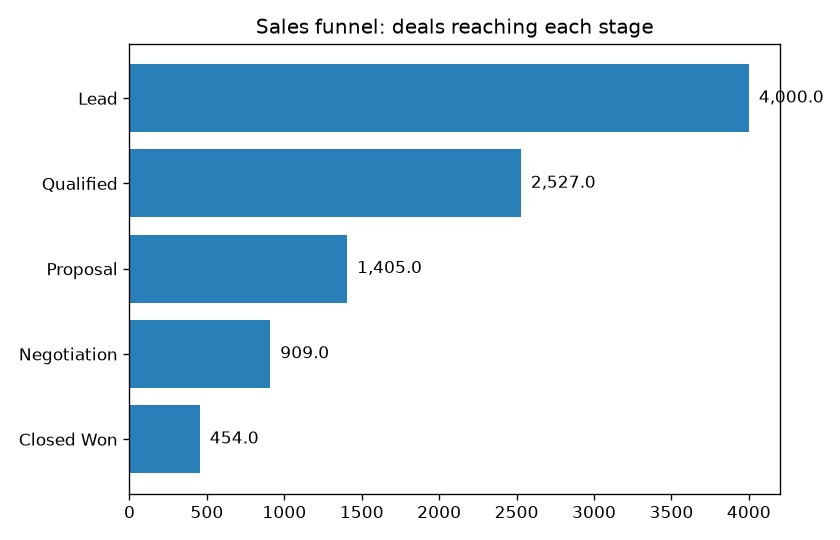
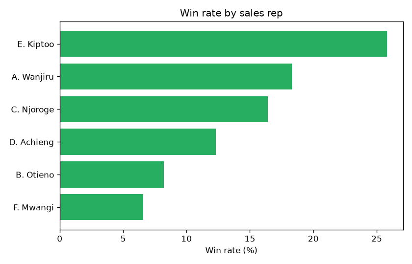
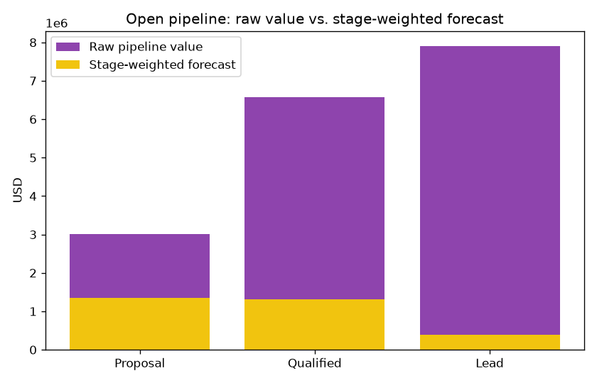
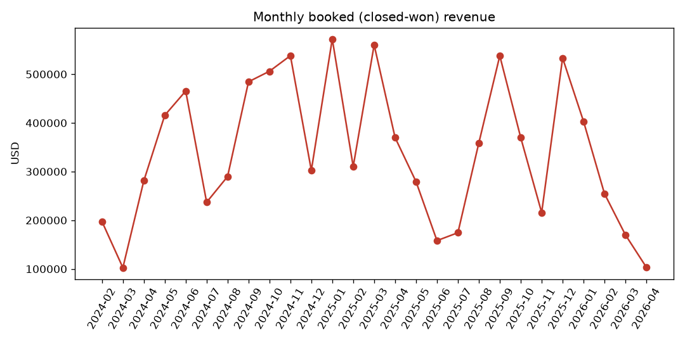

# Sales Pipeline Funnel Analytics

SQL-driven analysis of a B2B sales pipeline: where deals drop off, which
reps and lead sources actually convert, how deal velocity scales with deal
size, and what the open pipeline is realistically worth. Six standalone
`.sql` files a recruiter can read directly, plus the Python that runs them
and renders the charts.

**Note on data:** `data/deals.csv` is synthetically generated
(`src/generate_data.py`) with built-in funnel drop-off, rep-level skill
variance, and source-quality differences, so the SQL below is finding real
(if synthetic) patterns rather than noise. Synthetic by design — real,
reproducible numbers without using any real company's CRM data.

## The numbers

4,000 deals, Jan 2024–Apr 2026.

### 1. Funnel conversion ([`sql/01_funnel_conversion.sql`](sql/01_funnel_conversion.sql))

| Lead | → Qualified | → Proposal | → Negotiation | → Closed Won |
|---|---|---|---|---|
| 4,000 | 2,527 (63.2%) | 1,405 (55.6%) | 909 (64.7%) | 454 (49.9%) |

**Overall lead-to-won: 11.3%.** The biggest single drop is Qualified →
Proposal (55.6%) — that's where a sales-ops team should look first.



### 2. Win rate by rep ([`sql/02_win_rate_by_rep.sql`](sql/02_win_rate_by_rep.sql))

Top rep closes at **25.8%**, bottom rep at **6.6%** — a 4x spread on the
same lead pool. `total_booked_revenue_usd` is in the query too, since a
lower win rate on bigger deals can still out-earn a higher win rate on
small ones (it doesn't here, but the query answers that question either
way rather than assuming it).



### 3. Win rate by source ([`sql/03_win_rate_by_source.sql`](sql/03_win_rate_by_source.sql))

Referral (22.1%) and Partner (19.2%) convert meaningfully better than
Outbound (10.9%) — but Outbound and Inbound still drive the most total
volume, so the honest recommendation is "invest more in referral/partner
programs," not "stop doing outbound."

### 4. Deal velocity by segment ([`sql/04_deal_velocity.sql`](sql/04_deal_velocity.sql))

| Segment | Avg days to close (Won) |
|---|---|
| SMB | 42.6 |
| Mid-Market | 61.1 |
| Enterprise | 118.9 |

Enterprise deals take **~2.8x longer** than SMB — worth knowing when
forecasting a specific deal's close date, not just the aggregate pipeline.

### 5. Open pipeline value ([`sql/05_open_pipeline_value.sql`](sql/05_open_pipeline_value.sql))

Raw open pipeline vs. a simple stage-weighted forecast (5%/20%/45%/70% win
probability by stage — a standard, simplified CRM forecasting convention):



### 6. Monthly booked revenue ([`sql/06_monthly_booked_revenue.sql`](sql/06_monthly_booked_revenue.sql))



## Running it

```bash
pip install -r requirements.txt
python src/generate_data.py   # writes data/deals.csv
python src/load_db.py          # loads into data/pipeline.db (SQLite)
python src/run_analysis.py      # runs all 6 SQL files, writes reports/analysis_report.md + 4 charts
python -m pytest tests/ -v     # 5 tests against a hand-built fixture DB with known answers
```

Full text output of every query is in
[`reports/analysis_report.md`](reports/analysis_report.md) after running
`run_analysis.py`.

## Why the tests use a fixture, not the generated data

`tests/test_sql_queries.py` builds a tiny 5-row database with hand-computed
correct answers, rather than asserting against `deals.csv`. That way the
tests keep proving the *SQL is correct* even if `generate_data.py`'s random
parameters change later — testing against your own generated data mostly
just re-asserts whatever the generator happened to produce.

## Project structure

```
sql/
  01_funnel_conversion.sql
  02_win_rate_by_rep.sql
  03_win_rate_by_source.sql
  04_deal_velocity.sql
  05_open_pipeline_value.sql
  06_monthly_booked_revenue.sql
src/
  generate_data.py   synthetic CRM deal data with real funnel/rep/source patterns
  load_db.py           loads deals.csv into SQLite with indexes
  run_analysis.py       runs every .sql file, writes the markdown report + 4 charts
tests/
  test_sql_queries.py  each query vs. a fixture DB with known-correct answers
reports/
  analysis_report.md    full text output of all 6 queries
  figures/                the 4 charts above
.github/workflows/ci.yml  regenerates data, loads DB, runs full analysis + tests on every push
```
